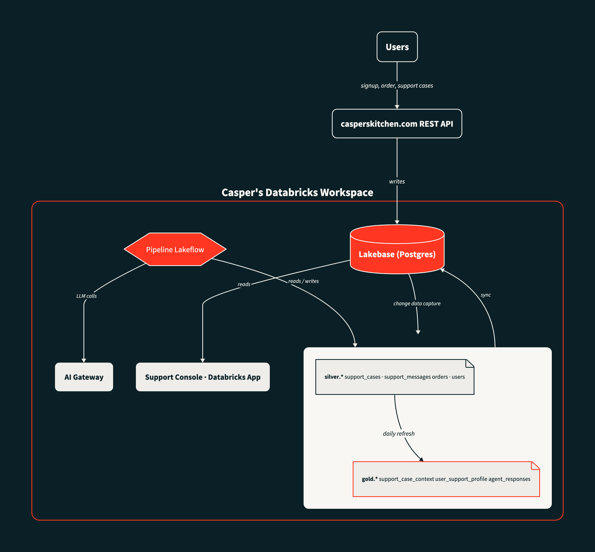

# Caspers Kitchen

A demo ghost-kitchen food delivery system. Customers sign up, browse a menu, place orders, and get deliveries. A traffic simulation generates realistic activity so the system always has fresh data to demo against. An analytics lakehouse, AI support agent, and internal support console close the loop from raw transactions to AI-assisted customer support.

## Architecture



> Diagram source: [`docs/architecture.d2`](docs/architecture.d2) — rendered with [D2](https://d2lang.com) + Playwright for PNG. Re-render: `d2 --theme 200 --pad 80 docs/architecture.d2 docs/architecture.svg && node docs/render-png.js`

### Data flow

1. **Users (simulated)** — A Vercel cron (`/api/cron/simulate`, every 5 min) generates realistic traffic: signing up users, placing orders, opening support cases, and progressing the full order/delivery lifecycle.

2. **REST API → Lakebase** — The Next.js API on Vercel writes all transactional data (users, orders, support cases, messages) into Lakebase (managed Postgres).

3. **Lakebase → Lakehouse (CDC)** — Lakebase automatically publishes change-data-capture history tables into Unity Catalog. No extra config needed.

4. **Pipeline (Lakeflow)** — A daily Lakeflow Declarative Pipeline reads CDC tables and builds **silver** (cleaned) and **gold** (enriched) materialized views: `support_case_context`, `user_support_profile`, `daily_revenue`, etc.

5. **AI Support Agent** — An hourly Lakeflow Job reads silver + gold tables, calls an LLM via AI Gateway, and writes `gold.support_agent_responses` with suggested replies and actions for each open case.

6. **Lakehouse → Lakebase (sync)** — Gold tables (including agent responses) are synced back into Lakebase as `gold.*_sync` tables via Lakehouse Sync.

7. **Support Console** — A Databricks App reads `gold.*_sync` tables and live `support_messages` from Lakebase, showing human agents each case with AI suggestions to review and act on.

## Key modules

| Module | Purpose |
|--------|---------|
| `lib/auth/` | better-auth server, session helpers, Drizzle adapter |
| `lib/db/` | Drizzle client, migrations, pool routing (Lakebase vs local Postgres) |
| `lib/lakebase/` | Databricks Lakebase connection with automatic OAuth token refresh |
| `lib/simulation/` | Traffic engine, seed data, backfill, cron auth, traffic model with diurnal/weekday/geo profiles |
| `lib/cart/`, `lib/orders/`, `lib/deliveries/`, `lib/drivers/`, `lib/menu/`, `lib/support/`, `lib/promotions/` | Domain schemas |

## API routes

| Route | Methods | Purpose |
|-------|---------|---------|
| `/api/auth/[...all]` | GET, POST | Auth (signup, login, session) |
| `/api/menu` | GET | List menu items |
| `/api/cart`, `/api/cart/[itemId]`, `/api/cart/promo` | GET, POST, DELETE | Cart management |
| `/api/orders`, `/api/orders/[id]`, `/api/orders/[id]/cancel` | GET, POST | Order lifecycle |
| `/api/deliveries`, `/api/deliveries/[id]/complete` | GET, POST | Delivery tracking |
| `/api/drivers` | GET | Driver listing |
| `/api/support`, `/api/support/[id]/messages` | GET, POST | Support cases |
| `/api/promos` | GET | Active promotions |
| `/api/users/me` | GET | Current user profile |
| `/api/cron/seed` | POST | Seed menu, drivers, admins, config |
| `/api/cron/simulate` | POST | Run one simulation tick |
| `/api/cron/status` | GET | Recent simulation runs |
| `/api/internal/simulation-config` | GET, PATCH | View/update traffic config |

## Environment

Env vars are managed through `better-env` config schemas with validation at startup.

- **Locally** — Databricks CLI token auth, npm via Databricks registry
- **Vercel** — M2M OAuth service principal, npm via public registry
- **Lockfile** — Committed with public `registry.npmjs.org` URLs; local installs go through the Databricks proxy transparently

## Running locally

```bash
npm install
cd apps/api
bash scripts/refresh-lakebase-token.sh   # refresh CLI token (~1hr TTL)
npm run dev                               # start Next.js dev server
npm run typecheck                         # type check
npm run build                             # production build
npm run fmt                               # format with prettier
```
